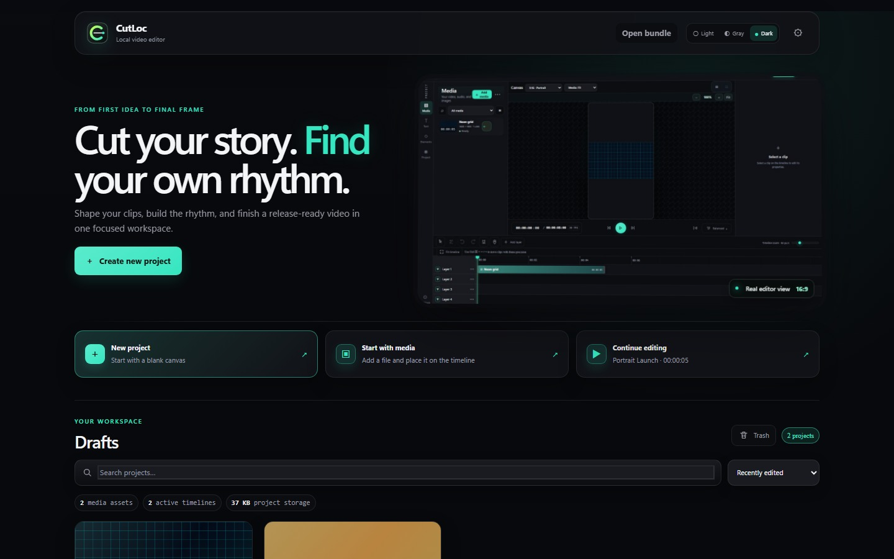
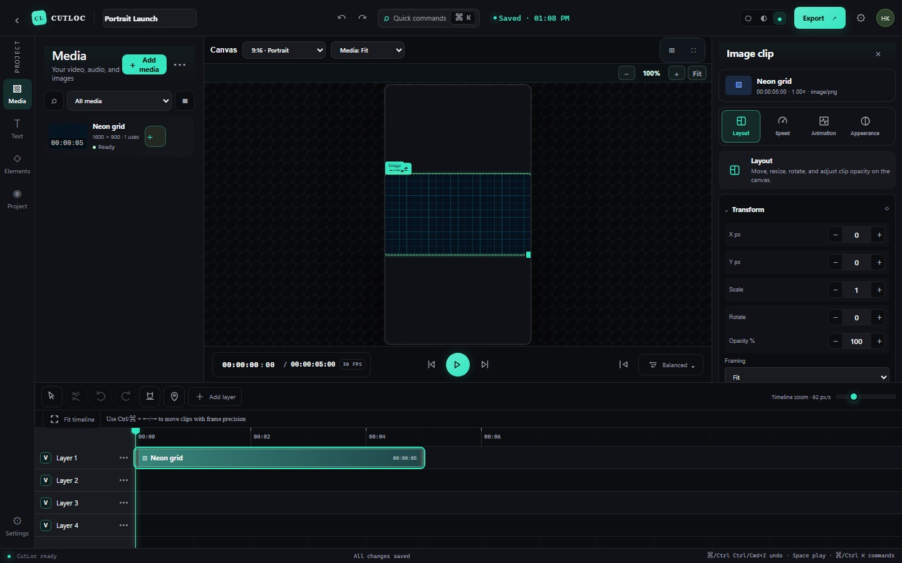

<div align="center">
  
  <h1>CutLoc</h1>
  <p><strong>An experimental, local-first video editor for creative work.</strong></p>

  [](#project-status)
  [](#project-status)
  [](https://github.com/HakanBabus/cutloc/actions/workflows/ci.yml)
  [](https://github.com/HakanBabus/cutloc/actions/workflows/codeql.yml)
  [](https://www.typescriptlang.org/)
</div>

> [!WARNING]
> **CutLoc v0.0.2 is experimental software.** Features are still changing, export and preview parity is not guaranteed for every media or effect combination, and project files may not remain compatible with future versions. Keep independent backups of important media and projects. Do not use this build as the only copy of production work.

CutLoc is a single-user video editor that runs on your own computer. It brings a media library, multi-track timeline, live canvas, clip Inspector, text and caption tools, project recovery, and FFmpeg-based export into one local workspace.

The product is intentionally small and exploratory: it is a serious engineering playground, not a production platform. The goal is to make the core loop feel useful while keeping the local-first boundary clear.



## What CutLoc is — and is not

CutLoc is designed around a simple principle: **your working media and project data stay on your device**. The local server binds to `127.0.0.1` by default and is not intended to be exposed as a public, LAN, hosted, or multi-user service.

It is:

- a local browser interface backed by a Fastify server;
- a frame-aware editor for arranging video, audio, image, text, and subtitle layers;
- a local FFmpeg workflow for previews, derived media, and exports;
- an experimental project for interface and editing-workflow exploration.

It includes:
- **Local-first workspace** — projects, media, proxies, thumbnails, waveforms, backups, and exports are stored locally.
- **Multi-track timeline** — arrange clips across layers, move them between compatible tracks, trim, split, duplicate, ripple-delete, and snap to useful boundaries.
- **Frame-aware editing** — move the playhead, markers, and selected clips using project frame precision.
- **Direct canvas editing** — click a visible text or media object to select the matching timeline clip and Inspector, then position, scale, rotate, flip, or adjust opacity while viewing the result.
- **Zoomable preview** — fit the canvas to the workspace, zoom in with a compact control, and scroll across the enlarged canvas without losing object selection.
- **Motion studio** — apply in, out, or combined animation presets, then tune duration, direction, easing, intensity, and linked timing.
- **Structured Inspector** — edit layout, trim, speed, animation, appearance, filters, keyframes, transitions, audio, text, and subtitles.
- **Media library** — import video, audio, and images; search, filter, sort, preview, and drag items onto the timeline.
- **Creative building blocks** — built-in stock surfaces, shapes inside the Media area, text styles, captions, and SRT/VTT subtitle import.
- **In-app help center** — searchable, topic-based guidance with shortcuts and direct links to the relevant editor panel.
- **Flexible workspace** — resize the tool rail, library, Inspector, preview, and timeline; saved layout settings persist locally.
- **Local export** — render MP4 video or MP3/WAV audio with selectable resolution, frame rate, quality, and range.
- **Safety-oriented project handling** — autosave, revision checks, backups, a recoverable trash area, and partial-output cleanup.
It is not:

- a hosted video platform or collaboration service;
- a replacement for a production editor with long-term file-format guarantees;
- a secure public upload or remote-rendering service;
- an automatic transcription or AI editing product yet.

## The editor in practice

The quickest way to understand CutLoc is to follow the work, not the component names.

### 1. Start a local project

From the dashboard, create a blank project or continue a draft. The workspace keeps project JSON, imported media, proxies, thumbnails, waveforms, backups, and exports under the local `data/` directory.

### 2. Bring media in

Use the **Media** area to:

- import video, audio, and image files;
- search, filter by type or usage, sort, and switch between list and card views;
- browse built-in stock surfaces and shapes;
- drag media into the timeline or add it with the card action.

### 3. Cut, trim, and arrange

Use the **Timeline** to do the practical editing work:

- trim from either edge of a clip;
- split a selected clip at the playhead;
- move clips with frame-aware positioning and optional snap;
- duplicate, ripple-delete, and undo/redo edits;
- set `I`/`O` range points and place markers;
- add, rename, reorder, duplicate, lock, hide, mute, or delete tracks.

### 4. Shape what is on screen

The **Canvas** and **Inspector** work together. Choose an aspect such as `16:9`, `9:16`, `1:1`, `4:5`, `3:2`, or `21:9`; switch between fit, fill, and smart framing; zoom or use safe-area and fullscreen views; then adjust the selected clip’s position, scale, rotation, flip, opacity, speed, crop, audio, filters, masks, fades, transitions, motion, and keyframes.

### 5. Add text, captions, and visual building blocks

The left tool rail exposes **Text**, **Captions**, **Project**, **Help**, and **Settings** surfaces. Text presets can be added to the timeline and edited in the Inspector. Shape presets, subtitle styling, and SRT/VTT import are available; automatic transcription is not a core feature in this release.

### 6. Preview, save, and export

Preview changes on the canvas, use the transport controls to move frame by frame, and export locally as **MP4**, **MP3**, or **WAV**. MP4 export supports aspect, resolution, FPS, quality, audio bitrate, and timeline range choices. Autosave, revision checks, backups, trash recovery, export preflight, and partial-output cleanup are part of the local workflow.



## Project status

**Current version: `0.0.2` — experimental.** This version is suitable for local testing, interface exploration, and continued development. Treat every feature below as a practical snapshot of the current checkout, not as a long-term compatibility promise.

| Area | v0.0.2 status |
| --- | --- |
| Local dashboard and project storage | Available locally |
| Video, audio, and image import | Available; codec support depends on the installed FFmpeg build |
| Media search, filtering, sorting, list/card views | Available; imported media also gets derived previews |
| Multi-track timeline editing | Available; still evolving |
| Canvas and Inspector controls | Available; parity varies by media and effect combination |
| Text, shapes, captions, SRT/VTT import | Available; still evolving |
| MP4, MP3, and WAV export | Available through local FFmpeg; export is re-encoded rather than lossless |
| Autosave, revision checks, backups, and trash | Available locally |
| English and Turkish interface | Dictionary-based editor coverage; some legacy labels and copy may still be incomplete |
| AI Chat | Visible as a disabled future placeholder |
| Automatic subtitles/transcription | Not available as a core feature |
| Hosted or collaborative editing | Not supported |

For the exact import/export boundaries, see [the media and export matrix](docs/MEDIA_EXPORT_MATRIX.md). For the product guarantees and deliberate non-guarantees, see [the product contract](docs/PRODUCT_CONTRACT.md).

## Technology

- **React 19** and **Vite** for the editor interface
- **TypeScript** across the client, server, and shared contracts
- **Zustand** and **Immer** for editor state and immutable project updates
- **Fastify** for the loopback-only local API
- **Zod** for shared runtime validation
- **FFmpeg / ffprobe** for probing, proxies, thumbnails, waveforms, and export
- **Node.js 24.x** in continuous integration

## Getting started

### Requirements

- Windows 10 or 11 is the current primary target.
- Node.js 24.x and npm are recommended.
- A Chromium-based browser is recommended for the current web interface.
- FFmpeg and ffprobe are supplied through the project dependencies for the supported local workflow.

### Clone and install

```powershell
git clone https://github.com/HakanBabus/cutloc.git
cd cutloc
npm ci
```

### Run in development mode

```powershell
npm run dev
```

On Windows PowerShell, use `npm.cmd run dev` if the local execution policy blocks the `npm` shim. Then open:

```text
http://127.0.0.1:5173
```

Vite serves the interface on port `5173` and proxies local API requests to Fastify on port `4173`.

### Run a production-style local build

```powershell
npm start
```

Then open:

```text
http://127.0.0.1:4173
```

## Useful commands

| Command | Purpose |
| --- | --- |
| `npm run dev` | Start the Vite interface and local API in development mode |
| `npm run build` | Build the shared package, web client, and server |
| `npm test` | Run shared-contract and server integration tests |
| `npm run verify` | Build everything and run the complete automated test suite |
| `npm start` | Build and start the production-style local server |
| `npm audit --omit=dev --audit-level=high` | Check production dependency advisories |

The current automated baseline does not include a registered browser test script. The web smoke path is documented as a manual release check in [docs/TESTING.md](docs/TESTING.md); this distinction keeps the public documentation honest about what CI actually runs.

## Documentation map

- [Product contract](docs/PRODUCT_CONTRACT.md) — local-first guarantees, experimental boundaries, project compatibility, and export behavior
- [Media and export matrix](docs/MEDIA_EXPORT_MATRIX.md) — accepted file classes, output formats, options, and tested combinations
- [Testing and baseline policy](docs/TESTING.md) — automated commands, CI gates, fixtures, and manual web smoke coverage

## Local data

By default, runtime files are written to the ignored `data/` directory:

```text
data/
├── projects/
│   └── <project-id>/
│       ├── project.json
│       ├── media/
│       ├── proxies/
│       ├── thumbnails/
│       ├── waveforms/
│       ├── backups/
│       └── exports/
├── trash/
└── settings.json
```

You can change the location with `DATA_DIR` in a local `.env` file. Never commit `.env`, project media, exports, or the `data/` directory.

## Security and privacy

- Keep the server bound to `127.0.0.1`.
- Do not expose it through a public interface, tunnel, LAN binding, or reverse proxy.
- Do not commit API keys, personal media, local projects, or exported files.
- Treat media from unknown sources carefully; FFmpeg processes complex native formats and the current experimental build does not provide a full process sandbox.
- AI settings are disabled by default and do not represent an active hosted provider workflow in this release.
- GitHub Actions run build, test, and dependency-audit checks for repository changes; CodeQL is configured separately.

## Contributing

CutLoc is still taking shape. Bug reports, focused fixes, interface feedback, documentation improvements, and small test-backed changes are welcome.

Keep changes reviewable by working on a feature branch and opening a pull request instead of pushing directly to `main`:

```powershell
git switch -c feat/short-description
npm run verify
git add <files>
git commit -m "Describe the change"
git push -u origin feat/short-description
```

In the pull request, explain the user-facing behavior, list validation performed, and include before/after screenshots for visible UI changes. Avoid committing generated output or personal media.

## License

No open-source license has been selected yet. Until a license is added, the repository remains **all rights reserved** by default.
