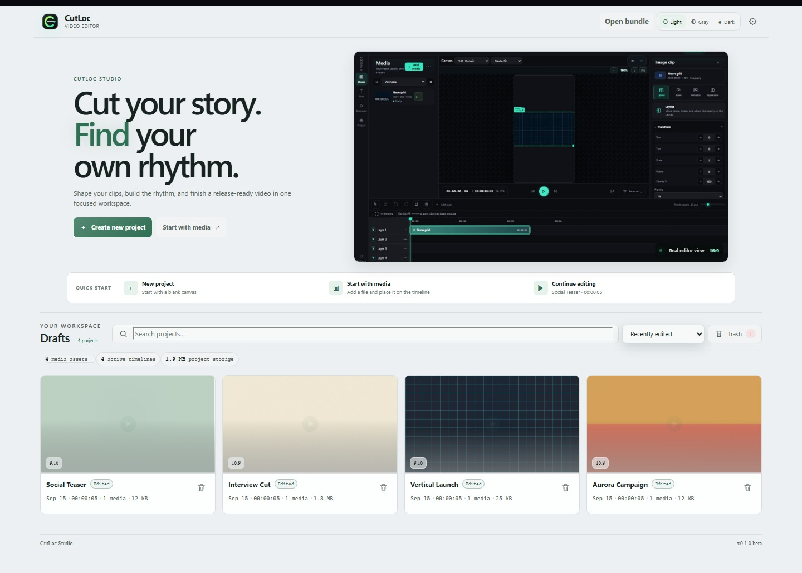

<!-- markdownlint-disable MD013 MD033 MD041 -->

[English](README.md) | [Türkçe](README.tr.md)

<div align="center">
  
  <h1>CutLoc</h1>
  <p><strong>Yaratıcı çalışmalar için yerel öncelikli bir video editörü.</strong></p>

  [](#proje-durumu)
  [](#proje-durumu)
  [](https://github.com/HakanBabus/cutloc/actions/workflows/ci.yml)
  [](https://github.com/HakanBabus/CutLoc/actions/workflows/github-code-scanning/codeql)
  [](https://www.typescriptlang.org/)
</div>

> [!IMPORTANT]
> **CutLoc v1.1.0 kaynak dağıtımını korurken günlük kullanımdaki tekrar kurulumu kaldırır.** Tek seferlik kullanıcı kurulumundan sonra `cutloc` her klasörden çalışır, gerektiğinde ortak yerel sunucuyu başlatır ve çalışma verilerini checkout dışında tutar.

CutLoc, kendi bilgisayarınızda çalışan tek kullanıcılı bir video editörüdür. Medya kitaplığı, çok kanallı zaman çizelgesi, canlı tuval, klip **Denetçisi**, proje kurtarma ve yerel FFmpeg dışa aktarma özelliklerini tarayıcı tabanlı tek çalışma alanında birleştirir.

CutLoc'u doğrudan tarayıcıdan kullanabilir, terminalden otomatikleştirebilir veya bir **yapay zekâ kodlama ajanının CutLoc CLI üzerinden kurgu yapmasını** sağlayabilirsiniz. CLI, web editörüyle aynı yerel doğrulama, revizyon, yedekleme ve proje erişim kurallarını kullanır. Böylece yapay zekâ destekli düzenlemeler uygulamayı atlamak veya proje dosyalarını elle değiştirmek zorunda kalmaz.

Proje bilinçli olarak belirli bir alana odaklanır: barındırılan bir prodüksiyon platformu değil, pratik bir yerel kurgu ortamıdır.



## İçindekiler

- [CutLoc ne yapar?](#cutloc-ne-yapar)
- [Kendiniz veya yapay zekâ ajanıyla kurgu](#kendiniz-veya-yapay-zekâ-ajanıyla-kurgu)
- [Özellik haritası](#özellik-haritası)
- [Editör iş akışı](#editör-iş-akışı)
- [Proje durumu](#proje-durumu)
- [v1.1.0](#v110)
- [Teknolojiler](#teknolojiler)
- [Hızlı başlangıç](#hızlı-başlangıç)
- [CLI ve otomasyon](#cli-ve-otomasyon)
- [Yerel veri ve yapılandırma](#yerel-veri-ve-yapılandırma)
- [Doğrulama](#doğrulama)
- [Güvenlik sınırları](#güvenlik-sınırları)
- [Belge haritası](#belge-haritası)
- [Katkıda bulunma](#katkıda-bulunma)
- [Lisans](#lisans)

## CutLoc ne yapar?

CutLoc, net bir yerel öncelikli sınır üzerine kuruludur:

- Projeler, içe aktarılan medya, türetilmiş önizlemeler, yedekler ve çıktılar yerel bilgisayarda saklanır.
- API varsayılan olarak loopback adresine bağlanır ve tek yerel kullanıcı için tasarlanmıştır.
- Kurgu, yerel Fastify sunucusuna bağlı tarayıcı arayüzünde yapılır.
- Medya analizi, türetilmiş dosyalar, önizlemeler ve çıktılar proje bağımlılıklarıyla sağlanan FFmpeg/ffprobe ikililerini kullanır.
- Yerel CLI, web editörüyle aynı API ve doğrulama sınırını kullanır; bu da onu sağlayıcıdan bağımsız yapay zekâ aracı otomasyonuna uygun hâle getirir.

CutLoc; barındırılan video platformu, iş birliği servisi, herkese açık yükleme uç noktası, uzaktan render servisi veya yerleşik transkripsiyon ürünü değildir. CutLoc, her codec ve efekt birleşiminde tarayıcı ile FFmpeg çıktısının aynı olacağını garanti etmez.

## Kendiniz veya yapay zekâ ajanıyla kurgu

CutLoc, aynı yerel proje üzerinde iki temel kontrol yüzeyi sunar:

| İhtiyacınız | Kullanım | Sağladıkları |
| --- | --- | --- |
| Görsel kurgu yapmak | **Web editörü** | Medya kitaplığı, tuval, Denetçi, zaman çizelgesi, geri al/yinele, otomatik kayıt ve dışa aktarma |
| Bir ajandan düzenleme istemek | **CutLoc CLI** | Makinece okunabilir proje bağlamı, eksiksiz zaman çizelgesi erişimi, güvenli revizyon kontrolleri ve özel düzenleme kilitleri |
| İki akışı birleştirmek | **Web + CLI** | Görsel çalışın, projeyi ajana devredin ve CLI erişimi bıraktığında tarayıcıdan devam edin |

Bir yapay zekâ ajanı projeyi inceleyebilir; medya ekleyebilir veya yeniden bağlayabilir; kanal ve klipleri düzenleyebilir; tuval, metin, filtre, geçiş ve anahtar kare verilerini değiştirebilir; dışa aktarma ön kontrolünü çalıştırabilir; dışa aktarma başlatabilir; işleri izleyebilir ve yedekleri kullanabilir. CLI **sağlayıcıdan bağımsızdır**: CutLoc projenizi yüklemez veya sizin adınıza bir yapay zekâ servisi seçmez.

```powershell
# Makinece okunabilir yetenek ve güvenlik rehberi
cutloc agent guide

# Canlı sunucu, proje, medya sağlığı, yedek ve iş bağlamı
cutloc agent inspect <project-id>
```

Yukarıdaki her başarılı komut `stdout` üzerinde tek ve kompakt bir JSON değeri döndürür; hatalar `stderr` üzerinde JSON olarak yazılır. Bu davranış, aracı kullanan ajanlar ve kabuk otomasyonları için öngörülebilir bir arayüz sağlar.

## Özellik haritası

| Yüzey | Mevcut yetenek |
| --- | --- |
| **Kontrol paneli ve projeler** | Tutarlı 16:9 proje kartlarında süreyi, medya sayısını, en-boy oranını ve diskte kaplanan alanı görme; projeyi doğrudan açma veya çöp kutusuna taşıma. |
| **Medya kitaplığı** | Video, ses ve görsel içe aktarma; arama, filtreleme, önizleme, liste/kart görünümü, medya sağlığını inceleme, türetilmiş dosyaları yeniden oluşturma ve varlıkları zaman çizelgesine sürükleme. |
| **Zaman çizelgesi** | Kare duyarlı oynatma kafası, işaretçiler, hizalama, kırpma, bölme, taşıma, çoğaltma, boşluğu kapatarak silme, geri al/yinele ve kanal kilitleme/gizleme/sessize alma kontrolleriyle video, kaplama, ses, metin ve altyazı kanalları. |
| **Tuval ve Denetçi** | Tuvalde görünen nesneleri seçme, en-boy ve sığdırma modları, önizleme yakınlaştırma/kaydırma; ardından yerleşim, kırpma, hız, ses, filtre, maske, fade, geçiş, anahtar kare ve metin biçimlendirme. |
| **Hareket ve yapı taşları** | Metin hazır ayarları ile Öğeler panelinden yerleşik arka plan ve şekiller. Seçili klibin Animasyon sekmesi giriş/çıkış hazır ayarlarını, süreyi, yönü, easing'i, yoğunluğu ve anahtar kareleri yönetir. |
| **Dışa aktarma** | Yerel ön kontrol; seçilebilir en-boy, çözünürlük, FPS, kalite, ses bit hızı ve zaman aralığıyla MP4 video veya MP3/WAV ses render'ı. Mevcut çıktı yaratıcı yeniden kodlamadır; kayıpsız/remux kesme değildir. |
| **Kurtarma ve güvenlik** | Otomatik kayıt, revizyon kontrolleri, yedekler, 30 gün kurtarılabilir çöp, proje erişim kilitleri, dışa aktarma ön kontrolü ve kısmi çıktı temizliği. |

## Editör iş akışı

### 1. Yerel proje oluşturun

Kontrol panelinden boş bir proje oluşturun veya taslağa devam edin. Windows'ta çalışma zamanı dosyaları varsayılan olarak `%LOCALAPPDATA%\CutLoc\data` altında tutulur.

### 2. Medya ekleyin ve düzenleyin

Video, ses veya görsel içe aktarmak için **Medya** bölümünü açın. Kitaplıkta arama ve filtreleme yapın, bir varlığı önizleyin veya uyumlu zaman çizelgesi kanalına sürükleyin. Yerleşik arka plan ve şekiller için **Öğeler** bölümünü kullanın.

### 3. Kesin ve sıralayın

Bir klibin iki kenarını kırpmak, oynatma kafasında bölmek, kare hassasiyetinde taşımak, yararlı sınırlara hizalamak, işaretçi eklemek ve geri al/yinele kullanmak için **Zaman Çizelgesi**ni kullanın. Kanallar eklenebilir, yeniden adlandırılabilir, sıralanabilir, çoğaltılabilir, kilitlenebilir, gizlenebilir, sessize alınabilir veya silinebilir.

### 4. Görüntü ve sesi şekillendirin

**Tuval** ve **Denetçi** birlikte çalışır. `16:9`, `9:16`, `1:1`, `4:5`, `3:2` veya `21:9` seçin; sığdırma, doldurma ya da akıllı kadraj modunu belirleyin; ardından konum, ölçek, dönüş, çevirme, opaklık, hız, kırpma, ses, filtre, maske, fade, giriş/çıkış animasyonu, anahtar kare ve metin stillerini ayarlayın. Animasyon kontrolleri yalnızca seçili klip için görünür.

### 5. Önizleyin, kaydedin ve dışa aktarın

Kurguyu incelemek için taşıma kontrollerini ve kare duyarlı oynatma kafasını kullanın. Otomatik kayıt ve revizyon kontrolleri çalışırken yerel projeyi korur. Kurgu hazır olduğunda dışa aktarma ön kontrolünü çalıştırın ve **MP4**, **MP3** veya **WAV** olarak yerel render alın.


## Proje durumu

**Güncel geliştirme sürümü: `1.1.0`.** V1 proje biçimini korurken kullanıcı seviyesinde komut, ortak runtime keşfi ve otomatik yerel sunucu başlangıcı ekler.

| Alan | v1.1.0 durumu |
| --- | --- |
| Kontrol paneli, proje bilgileri ve proje depolama | Kullanılabilir; kartlar güncel proje klasörü boyutunu gösterir |
| Video, ses ve görsel içe aktarma | Kullanılabilir; codec desteği kurulu FFmpeg yapısına bağlıdır |
| Medya arama, filtreleme, sıralama, liste/kart görünümü ve türetilmiş önizlemeler | Yerel olarak kullanılabilir |
| Çok kanallı zaman çizelgesi kurgusu | Kullanılabilir; gelişmeye devam ediyor |
| Tuval, Denetçi, hareket, metin, şekiller ve ayar katmanları | Kullanılabilir; uyum medya ve efekt birleşimine göre değişir |
| MP4, MP3 ve WAV dışa aktarma | Yerel FFmpeg üzerinden kullanılabilir; çıktı yeniden kodlanır |
| Otomatik kayıt, revizyon kontrolleri, yedekler ve çöp kurtarma | Kullanılabilir; çöp kutusu varsayılan olarak 30 gün sonra otomatik temizlenir |
| İngilizce ve Türkçe arayüz | Sözlük tabanlı kapsam; bazı eski etiketler ve metinler eksik olabilir |
| Yerel CLI ve yapay zekâ aracı otomasyonu | Özel proje erişim kilitleriyle loopback API üzerinden kullanılabilir |
| Barındırılan veya ortak çalışma kurgusu | Desteklenmiyor |
| Yerleşik transkripsiyon veya barındırılan yapay zekâ kurgusu | Mevcut editör kapsamının parçası değil |

Kesin içe/dışa aktarma sınırları ve geliştirme sözleşmeleri dahili mühendislik notlarında tutulur; bu genel README'de tekrarlanmaz.

## v1.1.0

CutLoc v1.1.0 ilk kararlı kaynak sürümün üzerine şunları ekler:

- Çıktı çözünürlüğü değiştiğinde önizleme ve FFmpeg dışa aktarma aynı tuval koordinatlarını kullanır.
- Açık, Gri ve Koyu temalar tutarlı editör yüzeyleri sunar; kompakt Hız ve Animasyon kontrolleri klavye erişimini korur.
- Tam ekran önizlemede timecode, toplam süre, oynatma kontrolleri ve kadraj araçları görünür kalır.
- Tek seferlik `setup:user`, `cutloc` komutunu kullanıcı PATH'ine kaydeder; `cutloc open` ortak sunucuyu başlatır veya yeniden kullanır ve tarayıcı editörünü açar.
- `cutloc stop` ve `cutloc restart`, ortak sunucunun yaşam döngüsünü açıkça yönetir; canlı komutlar uyumsuz kalan yönetilen sunucuyu otomatik yeniler. Stop/restart etkin medya işlerini kesmez; etkin editör oturumlarını kapatmak için açıkça `--force` gerekir.
- `cutloc status --json` ve `cutloc doctor --json`, makinece okunabilir runtime, sürüm, depolama, araç ve uyumluluk kontrolleri sunar.
- JSON öncelikli CLI; revizyon duyarlı düzenleme planlarını, proje kilitlerini, medya akışlarını, kurtarmayı, önizleme karesi almayı ve dışa aktarma otomasyonunu korur.
- Proje depolama sınırları, istek bütçeleri, otomatik kayıt birleştirmesi, yedekler, kurtarılabilir çöp ve kısmi çıktı temizliği otomatik testlerle korunur.

Proje biçimi `schemaVersion: 1` olarak kalır. `setup:user`, checkout içindeki eski `data/` klasörünü yeni hedef boşsa veya yalnızca runtime'ın oluşturduğu boş klasörleri içeriyorsa kopyalar. İki tarafta da veri varsa eksik eski projeler ve çöp kayıtları hedefteki çakışmaları ezmeden birleştirilir. Eski kopya daima korunur ve çakışmalar kurulum sonucunda listelenir.

## Teknolojiler

- Editör arayüzü için **React 19** ve **Vite**
- İstemci, sunucu, CLI ve ortak sözleşmelerde **TypeScript**
- Editör durumu ve değişmez proje güncellemeleri için **Zustand** ve **Immer**
- Yalnızca loopback üzerinde çalışan yerel API için **Fastify**
- Ortak çalışma zamanı doğrulaması için **Zod**
- Analiz, proxy, küçük resim, dalga biçimi ve çıktı için **FFmpeg / ffprobe**
- Tarayıcı regresyon kapsamı için **Playwright**
- Sürekli entegrasyonda **Node.js 24.x**

## Hızlı başlangıç

### Gereksinimler

- Güncel birincil hedef Windows 10 veya 11'dir.
- Kaynaktan kurulum için Node.js 24.x ve npm 11.x gereklidir.
- Mevcut web arayüzü ve tarayıcı testleri için Chromium tabanlı bir tarayıcı önerilir.
- Desteklenen yerel iş akışı için FFmpeg ve ffprobe proje bağımlılıklarıyla sağlanır.

### Klonlama ve kurulum

```powershell
git clone https://github.com/HakanBabus/cutloc.git
cd cutloc
npm.cmd ci
npm.cmd run doctor
npm.cmd run setup:user
```

İlk kurulumdan sonra yeni bir terminal açın ve CutLoc'u herhangi bir klasörden başlatın:

```powershell
cutloc open
```

`setup:user`; CutLoc'u derler, kullanıcı seviyesinde komut yönlendiricisi oluşturur, `%LOCALAPPDATA%\CutLoc\bin` klasörünü kullanıcı PATH'ine ekler ve kullanıcı depolamasını hazırlar. EXE veya masaüstü uygulaması kurmaz.

### Geliştirme modunda çalıştırma

```powershell
npm run dev
```

Bu komut Vite'ı `http://127.0.0.1:5173`, Fastify API'yi ise `http://127.0.0.1:4173` adresinde başlatır. Vite, yerel `/api` isteklerini Fastify portuna yönlendirir.

Windows PowerShell'de yerel yürütme ilkesi `npm` shim'ini engelliyorsa `.cmd` biçimini kullanın:

```powershell
npm.cmd ci
npm.cmd run dev
```

### Üretim benzeri yerel yapı

```powershell
npm start
```

Bu komut tüm çalışma alanlarını derler ve yerel sunucuyu `http://127.0.0.1:4173` adresinde başlatır. Windows'ta `NO_OPEN=1` ayarlanmadıkça sunucu yerel URL'yi otomatik açar.

`npm run dev` ve `npm start` ile başlayan yerel sunucu, isteğe bağlı kök `.env` dosyasını Node.js 24'ün yerleşik ortam dosyası desteğiyle yükler. Vite geliştirme proxy'si ve kök CLI script'leri aynı yerel `HOST` ve `PORT` değerlerini izler; böylece API portu değiştirildiğinde üç yüzey birbirinden kopmaz. Mevcut süreç ortam değişkenleri önceliklidir ve `.env` dosyasının bulunmaması kabul edilir.

## CLI ve otomasyon

CutLoc; mevcut projeleri yönetmek, eksiksiz proje düzenlemeleri uygulamak, medya içe aktarmak, yedekleri geri yüklemek, çıktıları başlatmak ve desteklenen JSON API rotalarına erişmek için JSON öncelikli bir CLI içerir. Tarayıcı editörüyle aynı yerel Fastify API'yi kullanır; yönetilen proje dosyalarını doğrudan değiştirmez.

`setup:user` sonrasında komut yüzeyini herhangi bir klasörden inceleyin. Canlı komutlar ortak sunucuyu gerektiğinde otomatik başlatır; `status` salt okunurdur ve sunucuyu başlatmaz:

```powershell
cutloc --help
cutloc status --json
cutloc doctor --json
cutloc stop
cutloc restart
```

Bir yapay zekâ ajanı veya başka bir JSON tüketicisi için makinece okunabilir rehber ve canlı inceleme komutlarıyla başlayın. `cli:agent` betiği npm yaşam döngüsü çıktısını susturur ve kompakt JSON'u otomatik etkinleştirir:

```powershell
cutloc agent guide
cutloc agent inspect --no-guide --limit 20
cutloc agent inspect <project-id>
```

Çok sayıda çağrı için her komutta yeniden derleme yapmak yerine bir kez derleyip yürütülebilir dosyayı doğrudan çağırın:

```powershell
npm.cmd run build:shared
npm.cmd run build:runtime
npm.cmd run build:cli
node apps/cli/dist/index.js --compact agent inspect <project-id>
```

`agent inspect` genel görünümü varsayılan olarak kompakt ve sayfalanmıştır. Dönen veriyi yönetmek için `--cursor`, `--limit`, `--no-guide` veya `--full` kullanın.

Kullanıcı CLI'ı güncel loopback API'yi `%LOCALAPPDATA%\CutLoc\runtime\instance.json` üzerinden keşfeder. Canlı instance yoksa canlı komutlar boş bir portta yeni instance başlatır. `--url` ve `CUTLOC_URL` açık override olarak kalır. Repo içindeki geliştirme CLI yönlendiricisi `.env` içindeki `HOST` ve `PORT` değerlerini de izler; kurulu komut ise başka geliştirme araçlarının CutLoc'u yanlış adrese yönlendirmemesi için bu genel değişken adlarını bilerek yok sayar. CLI loopback dışı sunucuları reddeder.

### Yapay zekâ aracıyla proje düzenleme

Bir yapay zekâ aracı güncel proje JSON'unu alabilir, yerelde düzenleyebilir ve sunucunun **revision** değerini koruyarak uygulayabilir:

```powershell
cutloc projects get <project-id> --out project.json
cutloc projects apply <project-id> --file project.json
```

Sunucu belgenin tamamını ortak **ProjectSchema** ile doğrular. Bu sırada başka bir istemci projeyi değiştirdiyse uygulama sessizce üzerine yazmak yerine çakışma döndürür.

Ajan tarafından hazırlanan zaman çizelgesi değişikliklerinde revizyon duyarlı düzenleme planını tercih edin:

```powershell
cutloc projects edit <project-id> --file edit-plan.json --dry-run
cutloc projects edit <project-id> --file edit-plan.json
```

Kısa video projelerini doğru tuvalle doğrudan başlatabilirsiniz:

```powershell
cutloc projects create "Kısa demo" --preset shorts
cutloc media add-many <project-id> scene-01.png voice.mp3 --wait
cutloc jobs wait <job-id> --timeout 300
```

Bir JSON işlem dizisi için kalıcı oturum kullanın:

```powershell
cutloc session <project-id>
```

Oturum stdin üzerinden satır başına bir JSON isteği okur ve satır başına bir JSON sonucu yazar:

```json
{"method":"GET","path":"/api/projects/<project-id>"}
{"method":"PATCH","path":"/api/projects/<project-id>","body":{"name":"Yerelde düzenlendi","revision":3}}
```

Projeyi değiştiren komutlar kısa ömürlü ve özel bir proje kilidi alır. Proje tarayıcıda açıksa CLI kontrolü devralabilir; web editörü komut veya oturum erişimi bırakana kadar salt okunur uyarısı gösterir. Kalp atışı süresi dolduğu için çöken bir CLI kalıcı kilit bırakamaz.

| Alan | Komutlar |
| --- | --- |
| Runtime | `open`, `status --json`, `doctor --json`, `stop` ve `restart` |
| Ajan keşfi | `agent guide` ve kompakt/sayfalanmış `agent inspect [project-id]` |
| Projeler | `projects list/create/get/edit/apply/duplicate/delete/import/bundle` |
| Medya | `media add/add-many/remove/relink/rebuild/health/stock` |
| Kurtarma | `backups list/restore` ve `trash list/restore/delete` |
| Dışa aktarma | `export preflight/start` ve `jobs list/get/wait/watch/cancel/download` |
| Ayarlar | `settings get/set` |
| Düşük seviye API | `api <method> </api/path>` |

Yüklemeler ve ikili dosyalar için özel medya ve proje paketi komutlarını kullanın. Genel `api` ve `session` komutları `/api/events` SSE uç noktasını akıtmaz; ikili yanıt indirirken `--out` kullanın.

## Yerel veri ve yapılandırma

Windows çalışma zamanı dosyaları varsayılan olarak checkout dışında tutulur:

```text
%LOCALAPPDATA%\CutLoc\
├── bin\
├── logs\
│   └── server.log
├── runtime\
├── temp\
└── data\
    ├── projects/
    │   └── <project-id>/
    │       ├── project.json
    │       ├── media/
    │       ├── proxies/
    │       ├── thumbnails/
    │       ├── waveforms/
    │       ├── backups/
    │       └── exports/
    ├── trash/
    └── settings.json
```

`CUTLOC_HOME` izole testlerde kullanıcı runtime kökünün tamamını, `DATA_DIR` ise yalnızca proje/ayar depolamasını değiştirir. Yönetilen `cutloc` başlangıcı, `DATA_DIR` değerini hem işlem ortamından hem kayıtlı checkout içindeki `.env` dosyasından uygular; `status` ve `doctor` etkin dizini raporlayıp test eder. Arka plan sunucusunun çıktısı `logs\server.log` içinde tutulur. Depodaki [`.env.example`](.env.example) geliştirme override'larını içerir. `.env`, API anahtarları, proje medyası, çıktılar veya runtime verisini asla commit'e eklemeyin.

## Doğrulama

Geliştirme sırasında odaklı kontrolleri, pull request açmadan önce ise tam temel doğrulamayı çalıştırın:

| Kontrol | Komut | Kapsam |
| --- | --- | --- |
| Derleme | `npm run build` | Ortak/runtime paketleri, web istemcisi, sunucu ve CLI |
| Ortak sözleşme testleri | `npm run test:shared` | Zod modelleri, varsayılanlar, zaman çizelgesi yardımcıları ve çıktı boyutları |
| Sunucu entegrasyon testleri | `npm run test:server` | Yerel API, proje/medya/kurtarma akışları, kilitler, FFmpeg işleri ve dışa aktarma |
| CLI entegrasyon testleri | `npm run test:cli` | CLI yürütülebilir dosyası, JSON çıktısı, argüman doğrulama, oturumlar ve API yönlendirme |
| Tarayıcı dışı tüm testler | `npm test` | Ortak paket, sunucu, CLI ve web yapılandırma testleri |
| Tarayıcı regresyonu | `npm run test:web` | Kontrol paneli, editör, otomatik kayıt, çakışmalar, kısayollar ve CLI kilit devri için Playwright Chromium kapsamı |
| Yerel temel | `npm run verify` | Derleme ve `npm test`; tarayıcı testleri ayrıdır |
| Tam otomatik temel | `npm run verify:all` | Derleme, tarayıcı dışı testler ve tarayıcı testleri |
| Üretim bağımlılığı denetimi | `npm audit --omit=dev --audit-level=high` | Yüksek veya daha ciddi üretim bağımlılığı uyarıları |
| Release adayı kapısı | `npm run release:check` | Önkoşullar, tam otomatik temel ve üretim bağımlılığı denetimi |

PowerShell'de tam yerel kontrol:

```powershell
npm.cmd run verify:all
npm.cmd audit --omit=dev --audit-level=high
```

Etiketli bir sürüm hazırlamadan önce birleşik aday kapısı olarak `npm.cmd run release:check` komutunu çalıştırın.

GitHub CI eşdeğer sırayı çalıştırır: kilitli kurulum, tüm çalışma alanlarının derlenmesi, ortak/sunucu/CLI testleri, Playwright Chromium kurulumu ve tarayıcı testleri, ardından üretim bağımlılığı denetimi.

## Güvenlik sınırları

- Sunucuyu `127.0.0.1` veya başka bir loopback adresinde tutun. LAN bağlantısı, tünel, ters proxy veya herkese açık arayüzle dışarı açmayın.
- CutLoc yerel önceliklidir ancak tam bir süreç sandbox'ı değildir. FFmpeg karmaşık yerel biçimleri işlediği için bilinmeyen kaynaklardan gelen medyayı dikkatli kullanın.
- Yerel CLI kendi başına barındırılan bir yapay zekâ sağlayıcısı başlatmaz veya proje verisini dış sağlayıcıya göndermez. API anahtarlarını ve kişisel medyayı commit'e eklemeyin.
- Dışa aktarma yerel ve yeniden kodlamalıdır. Önizleme/çıktı uyumu codec, filtre, hareket ve diğer efektlere göre değişebilir.
- Önemli proje ve medyaların bağımsız yedeklerini tutun. Güvenlik açığı bildirimleri için [güvenlik politikasına](SECURITY.md) bakın.

## Belge haritası

- [Ürün ve geliştirme rehberi](docs/README.md) — mimari, kurgu modeli, medya/çıktı davranışı, yerel veri, test ve sorun giderme.
- [CLI ve yapay zekâ ajanı rehberi](docs/CLI.md) — komut grupları, JSON iş akışları, oturumlar, kilitler, dışa aktarma otomasyonu ve güvenlik sınırları.
- [Release kontrol listesi](docs/RELEASE.md) — aday kapıları, sürüm eşitleme, kurulum kolaylığı ve yayın sınırları.
- [Güvenlik politikası](SECURITY.md) — bildirim rehberi ve dağıtım sınırları.

## Katkıda bulunma

CutLoc v1.1.0 güncel kaynak-dağıtım geliştirme hattıdır. Hata bildirimleri, odaklı düzeltmeler, arayüz geri bildirimleri, belge iyileştirmeleri ve testlerle desteklenen küçük değişiklikler memnuniyetle karşılanır.

Değişiklikleri incelenebilir tutmak için bir özellik branch'i üzerinde çalışın ve pull request açın:

```powershell
git switch -c feat/kisa-aciklama
npm.cmd run verify:all
npm.cmd audit --omit=dev --audit-level=high
git add <dosyalar>
git commit -m "Değişikliği açıklayın"
git push -u origin feat/kisa-aciklama
```

Pull request içinde kullanıcıya yansıyan davranışı açıklayın, yapılan doğrulamaları listeleyin ve görünür arayüz değişiklikleri için önce/sonra ekran görüntüleri ekleyin. Üretilmiş çıktıları veya kişisel medyayı commit'e eklemeyin.

## Lisans

CutLoc [MIT Lisansı](LICENSE) ile yayımlanır; bu lisansın koşulları altında özgürce kullanabilir, değiştirebilir ve yeniden dağıtabilirsiniz.
