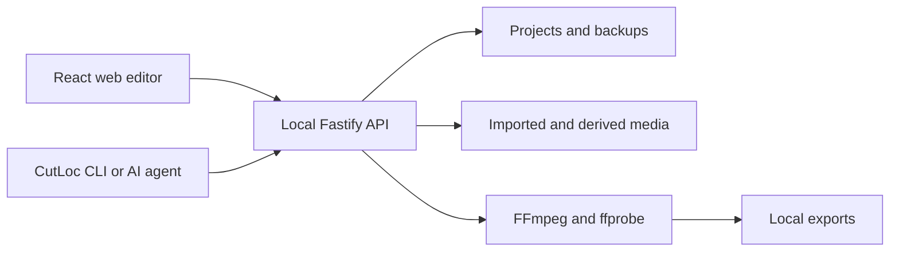

# CutLoc product and development guide

This document describes the public behavior of **CutLoc 1.1.0**: how the local application is structured, what the editor supports, where it stores data, how its shared runtime is discovered, and how to verify a change.

For terminal automation and AI-agent workflows, see the [CLI and AI-agent guide](CLI.md).

## Product boundary

CutLoc is a single-user, local-first video editor. The browser interface, command-line client, project storage, media processing, and FFmpeg export all run on the same computer.

CutLoc does not provide hosted storage, remote rendering, real-time collaboration, public uploads, or an embedded AI provider. The CLI is provider-neutral: an external AI agent may use it, but CutLoc does not send a project to that agent by itself.

The server binds to a loopback address by default. Do not expose it through a public interface, tunnel, or reverse proxy.

## v1.1.0 compatibility

- Project files remain on `schemaVersion: 1`; existing validated beta projects require no migration.
- The supported source runtime is Node.js 24.x with npm 11.x and the committed lockfile.
- Windows 10/11 is the primary local target. CI also verifies the build and browser suite on Linux.
- Preview/export geometry is resolution-aware: canvas-space position, scale, animation offsets, and text metrics are mapped to the selected export dimensions.
- CutLoc remains loopback-only and single-user. v1.1.0 does not introduce an installer, desktop shell, hosted service, public API deployment, or collaboration protocol.

## System overview



| Component | Responsibility |
| --- | --- |
| `apps/web` | Dashboard, media library, preview, Inspector, timeline, settings, autosave, and export UI |
| `apps/server` | Loopback API, validation, project persistence, access leases, media jobs, recovery, and export |
| `apps/cli` | JSON-first human and AI-agent access to the same API |
| `packages/shared` | Project schemas, timeline operations, export schemas, and shared types |

## Editing capabilities

### Projects and recovery

- Create, open, duplicate, import, bundle, delete, and restore projects.
- Autosave editor changes with optimistic revision checks.
- Preserve recoverable project backups and a local trash area. Trash entries are removed automatically after the configured retention window.
- Prevent silent overwrites when two browser tabs or a CLI client edit the same project.

### Media and timeline

- Import video, audio, and image files.
- Generate proxies, thumbnails, and waveforms where applicable.
- Search, filter, preview, relink, rebuild, and remove project media.
- Arrange video, image, audio, text, subtitle, shape, and adjustment clips on multiple tracks.
- Trim, split, move, duplicate, ripple-delete, snap, add markers, and use frame-aware timing.
- Lock, hide, mute, rename, reorder, duplicate, add, and remove tracks.

### Preview and Inspector

- Use `16:9`, `9:16`, `1:1`, `4:5`, `3:2`, and `21:9` canvases.
- Select clips from the canvas or timeline.
- Edit position, scale, rotation, opacity, framing, crop, speed, speed curves, and keyframes.
- Edit audio level, fades, filters, masks, transitions, and text styling.
- Use physical line breaks, `\\n`, or `/n` in text; preview and FFmpeg export normalize them to the same multiline layout.
- Apply entrance and exit animation presets with duration, direction, easing, and intensity controls.

## Project integrity

The current project document uses `schemaVersion: 1`. Every project written through the web editor or CLI is validated by the shared `ProjectSchema`.

Important invariants include:

- IDs are unique inside the project.
- Clip asset references point to existing assets.
- Source ranges remain inside the referenced media duration.
- Keyframe and speed-point times remain inside their clip.
- Timeline duration is derived from its clips.
- A mutation uses the latest project `revision`; stale writes receive a conflict instead of replacing newer work.

Do not edit `%LOCALAPPDATA%\CutLoc\data\projects\<id>\project.json` directly. Use the web editor or CLI so validation, revision checks, backups, and cleanup remain active.

## Installation and local operation

### Requirements

- Node.js 24.x and npm
- Windows 10/11 as the primary current target
- A Chromium-based browser for the web editor and browser tests

FFmpeg and ffprobe are supplied through npm dependencies for the supported local workflow.

### Install and run

```powershell
git clone https://github.com/HakanBabus/cutloc.git
cd cutloc
npm.cmd ci
npm.cmd run doctor
npm.cmd run setup:user
```

Open a new terminal, then start or reuse the shared runtime:

```powershell
cutloc open
```

Development services:

- Web editor: `http://127.0.0.1:5173`
- Local API: `http://127.0.0.1:4173`

For development, the existing source commands remain available:

```powershell
npm.cmd run dev
npm.cmd start
```

`npm start` builds every workspace and serves the built application from the local server. `cutloc open` uses the already-built output registered by `setup:user`, starts it silently on an available loopback port, and opens the browser. Use `cutloc stop` or `cutloc restart` to manage that shared background process; its output is retained in the runtime log.

## Local data and configuration

The default Windows runtime structure is:

```text
%LOCALAPPDATA%\CutLoc\
├── bin\cutloc.cmd
├── install.json
├── runtime\instance.json
├── logs\server.log
├── temp\
└── data\
    ├── projects\<project-id>\
    ├── trash\
    └── settings.json
```

Supported root `.env` values are documented in `.env.example`:

| Variable | Purpose |
| --- | --- |
| `HOST` | Local server host; keep this on loopback |
| `PORT` | Local API port |
| `WEB_PORT` | Vite development UI port; defaults to `5173` |
| `DATA_DIR` | Runtime project and settings directory |
| `CUTLOC_HOME` | Complete CutLoc user-runtime root; primarily used by isolated tests |
| `TRASH_RETENTION_DAYS` | Days deleted projects remain recoverable; defaults to `30` |
| `MAX_UPLOAD_BYTES` | Per-upload byte limit |
| `FFMPEG_TIMEOUT_MS` | Maximum FFmpeg job runtime |
| `FFMPEG_PATH` / `FFPROBE_PATH` | Optional binary overrides |
| `NO_OPEN` | Prevent automatic browser opening when set to `1` |

Never commit `.env`, user-runtime data, imported media, backups, or exports.

Managed CLI startup honors `DATA_DIR`, `FFMPEG_PATH`, and `FFPROBE_PATH` from the process environment first and then from the registered checkout's `.env`. `cutloc status --json` reports the effective project directory, while `cutloc doctor --json` tests that directory's permissions and FFmpeg text-rendering support.

## Media behavior

The upload filter recognizes these common file classes:

| Class | Common extensions |
| --- | --- |
| Video | `.mp4`, `.webm`, `.mov`, `.mkv`, `.avi`, `.m4v` |
| Audio | `.mp3`, `.wav`, `.m4a`, `.aac`, `.ogg`, `.flac`, `.opus` |
| Image | `.png`, `.jpg`, `.jpeg`, `.gif`, `.webp`, `.bmp`, `.tif`, `.tiff` |

Acceptance by the upload filter is not a guarantee that every codec inside a container can be decoded. Actual compatibility depends on the installed FFmpeg build and the media contents.

CutLoc checks the extension, declared MIME type, and probed content. Relinking also verifies that the replacement is compatible with existing clip source ranges. Removing an asset removes its referencing clips and managed source/derived files through the application boundary.

## Export behavior

CutLoc performs a creative render and re-encodes output; it is not a lossless remux cutter.

| Format | Video | Audio | Notes |
| --- | --- | --- | --- |
| MP4 | H.264 `libx264` | AAC | `yuv420p`, fast-start metadata |
| MP3 | — | `libmp3lame` | 128, 192, or 256 kbps; new exports default to 256 kbps |
| WAV | — | 16-bit PCM | Local uncompressed audio |

MP4 exports support 720p, 1080p, 2K/1440p, and 4K; 24, 25, 30, 50, and 60 FPS; draft, standard, high, and custom rate controls. Resolution follows the project aspect ratio and is rounded to valid even dimensions.

Before starting an export, preflight validates the project revision, timeline, source files, FFmpeg availability and text-rendering capability, settings, range, and estimated disk requirement. CutLoc prefers the bundled FFmpeg binary but can select a local full build when the bundled platform binary lacks `drawtext`. Invalid In/Out ranges do not silently fall back to the full timeline.

Export jobs are asynchronous. The UI combines server-sent events with a polling watchdog so a short job cannot finish unnoticed during connection setup. Concurrent requests for the same name receive unique output filenames. Completed jobs remain completed and downloadable; only queued or running jobs can be cancelled. Download headers support UTF-8 filenames while retaining an ASCII fallback.

## Operational safety

- Browser edits use autosave and revision-aware three-way merging.
- CLI mutations take a short exclusive project lease; that project becomes read-only in the web editor until the lease is released.
- A crashed CLI lease expires automatically.
- Failed or cancelled FFmpeg jobs remove partial output.
- Project deletion cancels its active jobs before moving data to trash.
- Backups and trash operations are explicit recovery boundaries, not substitutes for independent copies of important media. Opening the trash listing permanently removes entries beyond `TRASH_RETENTION_DAYS`.

## Verification

Use focused checks during development and the full baseline before publishing:

| Command | Coverage |
| --- | --- |
| `npm.cmd run build` | Shared, web, server, and CLI TypeScript/build output |
| `npm.cmd run test:shared` | Schemas, timeline operations, merge rules, and export dimensions |
| `npm.cmd run test:server` | API, persistence, media, recovery, leases, jobs, and real FFmpeg exports |
| `npm.cmd run test:cli` | Executable behavior, JSON output, sessions, routing, and agent discovery |
| `npm.cmd --workspace apps/web run test` | Development proxy and local runtime configuration |
| `npm.cmd run test:web` | Dashboard/editor behavior, autosave, conflicts, shortcuts, and UI regressions |
| `npm.cmd run verify:all` | Complete build plus every automated test layer |
| `npm.cmd audit --omit=dev --audit-level=high` | Production dependency audit |
| `npm.cmd run release:check` | Prerequisites plus the complete automated and dependency gate |

Also run `git diff --check` before committing. Browser tests use a temporary `DATA_DIR`; they must never operate on real user projects.

## Known limitations

- Preview and FFmpeg output share canvas geometry, but may still differ for codec-specific decoding, detailed typography, filters, or effect combinations.
- Text rotation and some typography features may be approximated during export; preflight reports known limitations.
- Hardware encoding, automatic transcription, hosted AI editing, collaboration, and lossless cutting are not included.
- Codec support is bounded by the installed FFmpeg build.
- Project compatibility is guarded by `schemaVersion`, but future incompatible changes may require migrations.

## Troubleshooting

### The UI opens but requests fail

Confirm that the API responds at `http://127.0.0.1:4173/api/health` and that the browser is using the expected local origin.

For the managed shared server, run `cutloc doctor --json` and inspect `%LOCALAPPDATA%\CutLoc\logs\server.log`. Use `cutloc restart` after correcting configuration.

### A project is read-only

Check for an active CLI command or session. Normal commands release their lease on completion; abandoned sessions expire after their heartbeat stops.

### Import or export fails

Run export preflight, inspect the job error, confirm available disk space, and verify the media with the same FFmpeg/ffprobe build used by CutLoc. A recognized extension alone does not prove codec compatibility.

### PowerShell blocks `npm`

Use `npm.cmd`, as shown throughout this guide.

## Documentation

- [CLI and AI-agent guide](CLI.md)
- [Release checklist](RELEASE.md)
- [Project README](../README.md)
- [Changelog](../CHANGELOG.md)
- [Security policy](../SECURITY.md)
